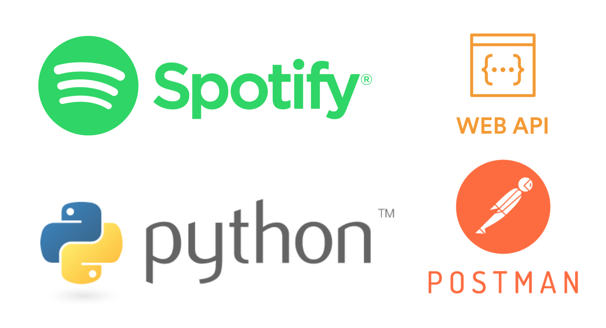
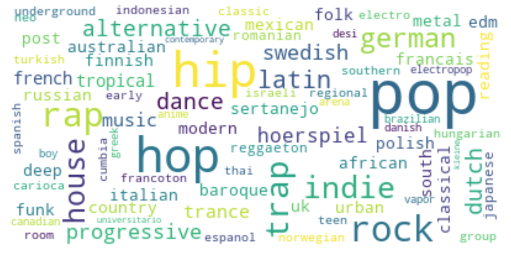
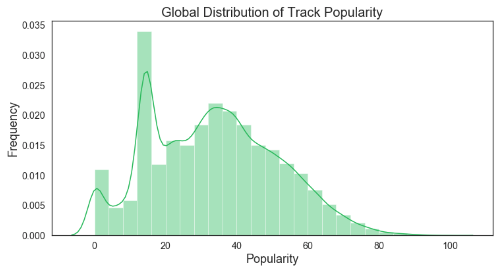
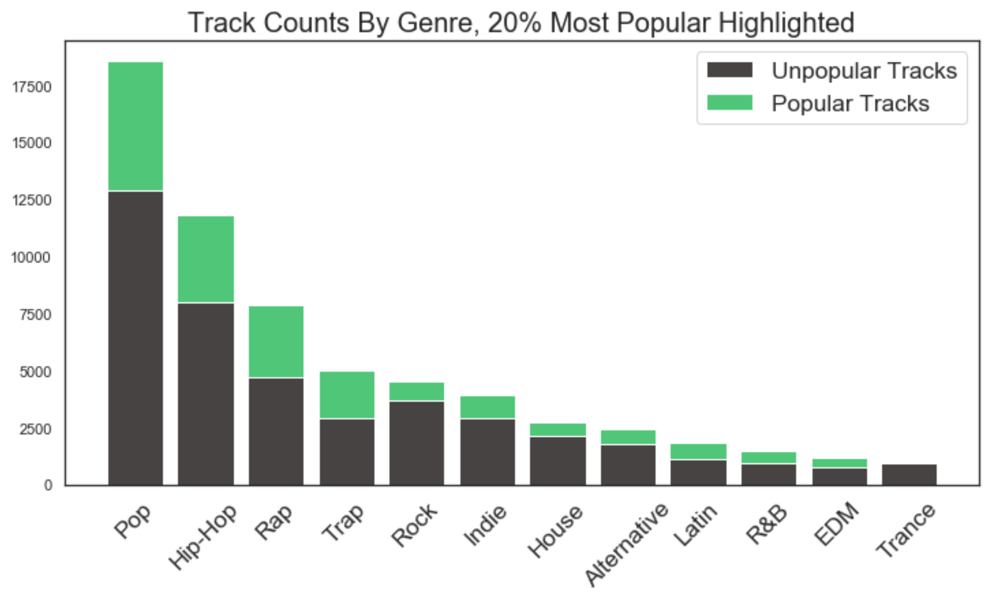
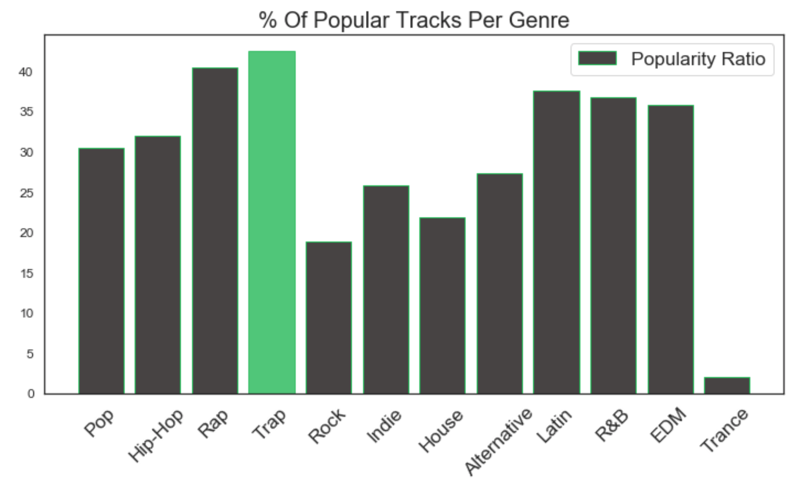
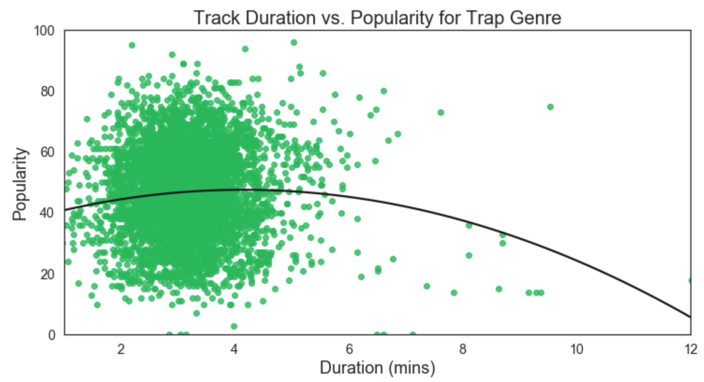
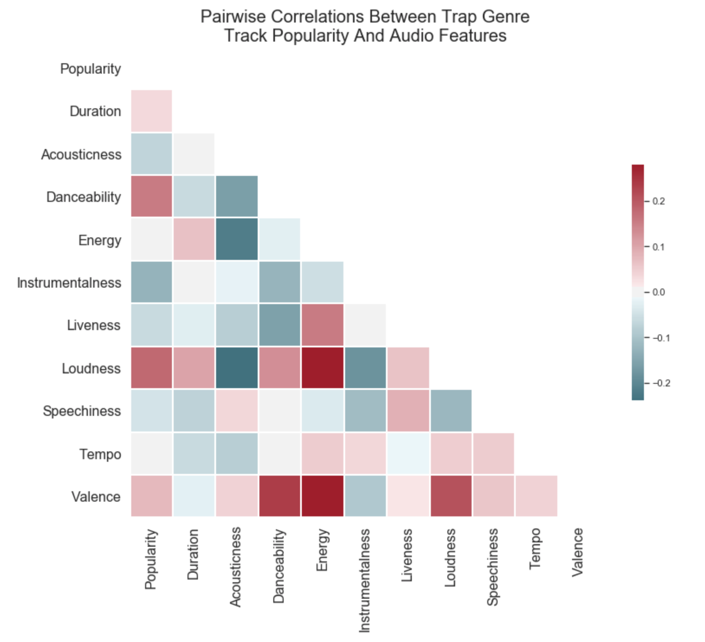

# Music Genre Analysis Using the Spotify Web API



As a musician and a nerd, I am always interested in new developments that occur at the interface between creativity and technology. [Spotify](https://www.spotify.com/is/) was founded in 2006 and has become the [biggest paid-for streaming service on the planet](https://www.rollingstone.com/music/music-features/who-will-own-spotify-in-five-years-876693/). Spotify is a very data-driven company, so I was interested in performing some data analysis, specifically around music genres and popularity.

## Data Acquisition and Processing

Spotify has an extensive documentation online for their APIs and SDKs located at [Spotify for Developers](https://developer.spotify.com). My goal was to use Python to perform my data analysis, and discovered [Spotipy](https://spotipy.readthedocs.io), which is a lightweight Python library for the Spotify Web API. As a [RESTful API](https://restfulapi.net), the various Spotify Web API [endpoints](https://developer.spotify.com/documentation/web-api/reference/) return data in JSON format in response to queries.

I used both the [Spotify Web API Tutorial](https://developer.spotify.com/documentation/web-api/quick-start/) and the [Spotipy Getting Started Guide](https://spotipy.readthedocs.io/en/latest/#getting-started) to set up my Web API access for Spotipy. In parallel, I also set up access for [Postman](https://www.getpostman.com), which is a widely used, free REST API Client. Throughout the project, I frequently switched back and forth, using the direct Web API access that Postman provided to spot check requests and responses, and then using Python/Spotipy to submit scripted batch requests, which were then processed further.

Setting up access requires registering your application(s) (Spotipy and Postman in my case) at developer.spotify.com in order to get the Client ID and Client Secret Keys for each application. For Spotipy, I then set these up as environment variables on my local system for security purposes.

I created a Python class called SpotipyData in order to perform my API data retrieval. I implemented the [Client Credentials Flow using the OAuth 2.0 protocol](https://developer.spotify.com/documentation/general/guides/authorization-guide/) in my Python class, since this option has a higher rate limit. In Postman, I used the somewhat simpler Authorization Code Flow, which was sufficient for the intermittent calls I was making.

As opposed to having quotas, the Spotify Web API uses Rate Limiting to share access bandwidth equally across all users. However, when iterating through a large amount of data, the **maximum offset** is currently **10,000**, which means, for example, that it is not possible to build a list of more than 10,000 songs from one call.

I decided that I wanted to build a data set of tracks that was fairly random and as deep as possible, so I used the **search endpoint**. The **search endpoint** allows results to be limited by year, but not by any smaller timeframe. I limited my search to **albums** with a release date of **2019**, and got to the limit of 10,000 albums before exhausting Spotify's catalog. I then got more details for those 10,000 albums with 2019 release dates using the *Get Several Albums* endpoint, and then got the IDs for all of the tracks on those albums using the *Get Album Tracks* endpoint. This then became my master list, and I got all the details I was interested in for all of the tracks using the *Get Track Audio Features* and *Get Several Tracks* endpoints.

This left me with a pandas dataframe with 54680 rows and 27 columns.

The data retrieval was a significant part of this project. Some of the biggest challenges came from the complicated, nested JSON responses, of which here is a short excerpt:

```json
{
  "albums": {
    "href": "https://api.spotify.com/v1/search?query=year%3A2019&type=album&market=US&offset=0&limit=20",
    "items": [
      {
        "album_type": "album",
        "artists": [
          {
            "external_urls": {
              "spotify": "https://open.spotify.com/artist/06HL4z0CvFAxyc27GXpf02"
            },
            "href": "https://api.spotify.com/v1/artists/06HL4z0CvFAxyc27GXpf02",
            "id": "06HL4z0CvFAxyc27GXpf02",
            "name": "Taylor Swift",
            "type": "artist",
            "uri": "spotify:artist:06HL4z0CvFAxyc27GXpf02"
          }
...
```
The data had to be extracted within the queries using nested "for"-loops, like the following excerpt:
```python
def spotipy_album_search(self, range_limit=10000, search_year=2019):
    for i in range(0,range_limit,50):
        album_results = self.sp.search(q='year:' + str(search_year),
                                        type='album', market='US', limit=50,
                                        offset=i)
        for i, j in enumerate(album_results['albums']['items']):
            artist_name.append(j['artists'][0]['name'])
            album_name.append(j['name'])
```
The following **print** statement proved invaluable while troubleshooting how to extract various JSON data:
```python
print(json.dumps(VARIABLE, sort_keys=True, indent=4))
```


## Simplifying Genre Information

Once I had the data in a DataFrame, an issue with the genre information became apparent. The genre information was in the form of lists of very specific genre tags, for example:

```python
"dmv rap, hip hop, pop rap, rap, trap music, underground hip hop, vapor trap"
```

After separating out all of the different genre tags, a count showed that there were 1499 unique genre tags in the list. In order to analyze the data more easily, I split all of these genre tags into individual words, which resulted in the following relative frequencies:



Based on this information, I decided to group the tracks into 12 categories by genre. These were more or less the most popular, after removing some nationalities ("German", "Dutch", "Swedish", etc.) and less musical categories, like "hoerspiel" (German for "radio play").

```python
'Pop', 'Hip-Hop', 'Rap', 'Trap', 'Rock', 'Indie', 'House', 'Alternative', 'Latin', 'R&B', 'EDM', 'Trance'
```
## Who Comes Up With 1,499 Different Genre Names?
After spending this much time working with the genre information on Spotify, I got curious and did some more research into this part of their technology. [The Echo Nest](https://en.wikipedia.org/wiki/The_Echo_Nest) is a music intelligence and data platform for developers and media companies, and they were aquired by Spotify in 2014. They began as a research spin-off from the MIT Media Lab to understand the audio and textual content of recorded music, and Spotify uses their technology today to create Taste Profiles based on the listening patterns of users. It is the driving force behind the playlists professionally curated on Spotify.

For a deeper dive into this genre complexity, visit everynoise.com. From the creators:

*Every Noise at Once is an ongoing attempt at an algorithmically-generated, readability-adjusted scatter-plot of the musical genre-space, based on data tracked and analyzed for 3,482 genre-shaped distinctions by Spotify as of 2019-09-12.*

## How could I maximize my chances of making a popular song on Spotify?

At this point I also started looking at **Popularity** scores for tracks. From the Spotify API reference for **Popularity**:

*The popularity of a track is a value between 0 and 100, with 100 being the most popular. The popularity is calculated by algorithm and is based, in the most part, on the total number of plays the track has had and how recent those plays are.*

A quick sort reveals the most popular song in the data set, with a Popularity sore of 100:

[![][images/mendes_senorita.png][https://p.scdn.co/mp3-preview/8eab3a5695bfaed5449e0787146f857fb9635907?cid=3bb746dbeccf420f9210e16d14c951f3]

An analysis of the **Popularity** ratings in my data set showed that the **top 20% most popular tracks** had a popularity rating of **50** or above.



Tracks were assigned to genres if the genre was present in their genre tags, which means that one track might appear in more than one genre:

```python
genre_track_counts_total = [len(df_drop_genres[df_drop_genres['genres']
                            .str.contains(genre)]) for genre in 
                            genre_split_list]
print(temp_counts_total)

[18570, 11853, 4554, 7893, 5046, 3973, 2743, 1864, 2472, 1504, 957, 1179]
```
For the purposes of this project that was preferable to assigning each track to one unique genre only.



While Pop music (unsurprisingly) has both the highest number of total tracks as well as popular tracks, the Trap music genre actually has the highest percentage of popular songs, so I will focus the rest of my analysis here.



For the uninitiated, Wikipedia describes [Trap music](https://en.wikipedia.org/wiki/Trap_music) as follows:

*Trap music is a style of hip hop music that was developed in the late 1990s to early 2000s in the Southern United States. It is typified by sub-divided hi-hats, heavy, sub-bass layered kick drums in the style of the Roland TR-808 drum machine, typically in half time syncopated rhythms, [and] layered with abstract or orchestral synthesizers[...]*

Within the Trap genre, a plot comparing track duration to popularity shows a familiar distribution with most tracks clustered around a duration just under four minutes. 



There is an outlier that I was interested in, which is quite long at almost ten minutes and very popular. This ended up being the following track from Brazil:

<iframe src="https://open.spotify.com/embed/track/2FGhB10Gon36GgFcOTMQEW" width="300" height="80" frameborder="0" allowtransparency="true" allow="encrypted-media"></iframe>

I created a heatmap in order to see if there were any other interesting correlations within the Audio Features for all of the tracks in this genre. The following heatmap shows that **Popularity** is positively correlated with **Loudness** and **Danceability**, which is not surprising. Amongst the AudioFeatures themselves, Energy, Danceability and Loudness are all positively correlated, which also makes intuitive sense.



As a final analysis, I checked which songs had the highest values for several of the Audio Features within the Trap genre. Since these values are algorithmically generated, most of the songs with extreme values did not seem terribly interesting. However, the song with the maximum value of **Danceability** is worth sharing. Please enjoy a sample of the most danceable Trap song currently on Spotify.

<iframe src="https://open.spotify.com/embed/track/059qHo8ssvJrMKwu1EXOpn" width="300" height="380" frameborder="0" allowtransparency="true" allow="encrypted-media"></iframe>