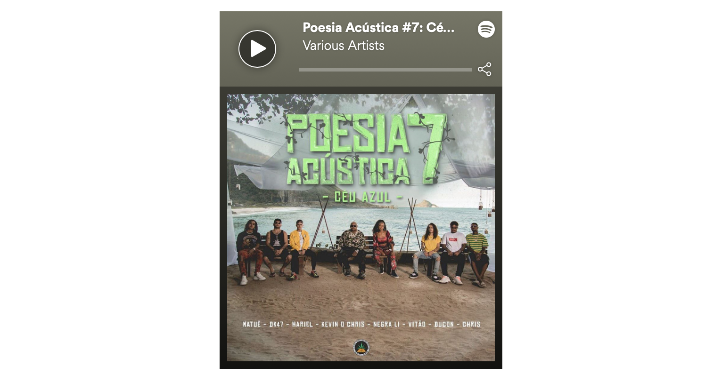
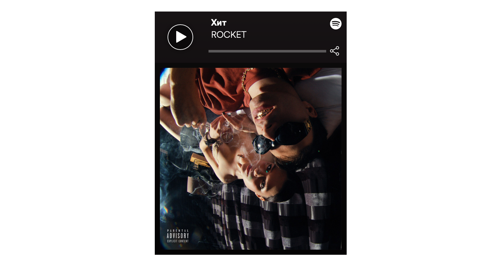

# Music Genre Analysis Using the Spotify Web API

[](developer.spotify.com)


## Table of Contents  
* [Overview](##overview)<BR>
* [Building a Data Pipeline](##data_pipeline)<BR>
  * [Endpoints](##endpoints)<BR>
  * [Data Acquisition and Processing](##data_acquisition)<BR>
  * [Data Pipeline Challenges](##pipeline_challenges)<BR>
* [Simplifying Genre Information](##simplifying_genre)<BR>
  * [Who Comes Up With 1,499 Different Genre Names?](##genres_background)<BR>
* [How can I maximize my chances of making a popular song on Spotify?](##maximize_popularity)<BR>
  * [Popularity In General](##general_popularity)<BR>
  * [Popularity By Genre](##genre_popularity)<BR>
  * [Trap Music Genre Analysis](##trap_genre)<BR>
* [Conclusion and Future Project Ideas](##conclusion_future)<BR>


<a name="#overview"></a>

## Overview

As a musician and a tech enthusiast, I am always interested in new developments that occur at the interface between creativity and technology. [Spotify](https://www.spotify.com/is/) was founded in 2006 and has become the [biggest paid-for streaming service on the planet](https://www.rollingstone.com/music/music-features/who-will-own-spotify-in-five-years-876693/). Spotify is a very data-driven company, so I was interested in performing some data analysis around music genres and popularity. My goal was to analyse a set of tracks that was fairly random and as deep as possible, so I focused only on tracks released in 2019 (up until early September).

<a name="#data_pipeline"></a>

## Building a Data Pipeline

Spotify has extensive documentation online for their APIs and SDKs located at [Spotify for Developers](https://developer.spotify.com). My goal was to use Python to perform my data analysis, so I used [Spotipy](https://spotipy.readthedocs.io), which is a lightweight Python library for the Spotify Web API. As a [RESTful API](https://restfulapi.net), the various Spotify Web API [endpoints](https://developer.spotify.com/documentation/web-api/reference/) return data in JSON format in response to queries.

<a name="#endpoints"></a>

### Endpoints

For this project I used the following Sporify Web API endpoints:<BR>

* [Search Endpoint](https://developer.spotify.com/documentation/web-api/reference/search/search/) to get a list of 10,000 albums (API max offset) with 2019 release dates.<BR>

* [Get Several Albums Endpoint](https://developer.spotify.com/documentation/web-api/reference/search/search/) to get additional details for all albums, including genre. Genre information is not available at the track level, so I got it at the album level here.<BR>

* [Get Album Tracks Endpoint](https://developer.spotify.com/documentation/web-api/reference/albums/get-albums-tracks/) to get the track IDs for the album list, which ended up being around 55,000.<BR>

* [Get Audio Features for Several Tracks Endpoint](https://developer.spotify.com/documentation/web-api/reference/tracks/get-several-audio-features/) to get audio features details for all 55,000 tracks.<BR>

* [Get Several Tracks Endpoint](https://developer.spotify.com/documentation/web-api/reference/tracks/get-several-tracks/) to get details such as popularity and duration for all 55,000 tracks.<BR>

I used both the [Spotify Web API Tutorial](https://developer.spotify.com/documentation/web-api/quick-start/) and the [Spotipy Getting Started Guide](https://spotipy.readthedocs.io/en/latest/#getting-started) to set up my Web API access for Spotipy. In parallel, I also set up access for [Postman](https://www.getpostman.com), which is a widely used, free REST API Client. Throughout the project, I frequently switched back and forth, using the direct Web API access that Postman provided to spot check requests and responses, and then using Python/Spotipy to submit scripted batch requests, which were then processed further.

[](https://developer.spotify.com/documentation/general/guides/authorization-guide/)

I registered both of my applications at developer.spotify.com to get my Client ID and Client Secret Keys and set them up as environment variables on my local system for security purposes. I then created a Python class in order to perform my API data retrieval. I implemented the [Client Credentials Flow using the OAuth 2.0 protocol](https://developer.spotify.com/documentation/general/guides/authorization-guide/), since this option has a higher rate limit. In Postman, I used the simpler Authorization Code Flow, which was sufficient for the intermittent calls I was making.

<a name="#data_acquisition"></a>

### Data Acquisition and Processing

As opposed to having quotas, the Spotify Web API uses Rate Limiting to share access bandwidth equally across all users. However, when iterating through a large amount of data, the **maximum offset** is currently **10,000**, which means that it is not possible to build a list of more than 10,000 items (e.g. songs) from one call.

The **search endpoint** allows results to be limited by year, but not by any smaller timeframe. I limited my search to **albums** with a release date of **2019**, and got to the limit of 10,000 albums before exhausting Spotify's catalog. From there, I followed the steps detailed in the [Endpoints](##endpoints) section above to build a fully-featured track list.

This left me with a pandas dataframe with 54680 rows and 27 columns.

<a name="#pipeline_challenges"></a>

### Data Pipeline Challenges

The data retrieval was a significant part of this project. Some of the biggest challenges came from the complicated, nested JSON responses. Here is a short excerpt of a [Search Endpoint](https://developer.spotify.com/documentation/web-api/reference/search/search/) response:

```yaml
{
  "albums": {
    "href": "https://api.spotify.com/v1/search?query=year%3A2019&type=album&market=US&offset=0&limit=20",
    "items": [
      {
        "album_type": "album",
        "artists": [
          {
            "external_urls": {
              "spotify": "https://open.spotify.com/artist/06HL4z0CvFAxyc27GXpf02"
            },
            "href": "https://api.spotify.com/v1/artists/06HL4z0CvFAxyc27GXpf02",
            "id": "06HL4z0CvFAxyc27GXpf02",
            "name": "Taylor Swift",
            "type": "artist",
            "uri": "spotify:artist:06HL4z0CvFAxyc27GXpf02"
          }
```
The data was extracted within the queries using nested for-loops, like the following sample:
```python
def spotipy_album_search(self, range_limit=10000, search_year=2019):
    for i in range(0,range_limit,50):
        album_results = self.sp.search(q='year:' + str(search_year),
                                        type='album', market='US', limit=50,
                                        offset=i)
        for i, j in enumerate(album_results['albums']['items']):
            artist_name.append(j['artists'][0]['name'])
            album_name.append(j['name'])
```
The following **print** statement proved invaluable while troubleshooting how to extract various JSON data, since it allowed the structure of the data to be easily visible in a python context:
```python
print(json.dumps(VARIABLE, sort_keys=True, indent=4))
```

<a name="#simplifying_genre"></a>

## Simplifying Genre Information

Once I had my data, an issue with the genre information became apparent. The genre information was in the form of lists of very specific genre tags, like this example from a single track:

```python
"dmv rap, hip hop, pop rap, rap, trap music, underground hip hop, vapor trap"
```

An analysis showed that there were **1499 unique genre tags** in my data set. In order to make this information usable, I split all of these genre tags into individual words, which resulted in the following relative frequencies:


Based on this information, I decided to group the tracks into 12 categories by genre. These were more or less the most popular, after removing some nationalities ("German", "Dutch", "Swedish", etc.) and less musical categories, like "hoerspiel" (German for "radio play").

```python
'Pop', 'Hip-Hop', 'Rap', 'Trap', 'Rock', 'Indie', 'House',
'Alternative', 'Latin', 'R&B', 'EDM', 'Trance'
```

<a name="#genres_background"></a>

### Who Comes Up With 1,499 Different Genre Names?

After discovering the (seemingly unreasonable) scope of genre tags, I got curious and did some more research into this part of Spotify's technology. As it turns out, Spotify aquired [The Echo Nest](https://en.wikipedia.org/wiki/The_Echo_Nest) in 2014, which is a music intelligence and data platform for developers and media companies. The company began as a research spin-off from the [MIT Media Lab](https://www.media.mit.edu) with the goal of understanding the audio and textual content of recorded music, and Spotify now uses this technology to create Taste Profiles based on the listening patterns of their users. It is the driving force behind the professionally curated playlists on Spotify.

For a deeper dive into this genre complexity, visit everynoise.com. From the creators:

> *Every Noise at Once is an ongoing attempt at an algorithmically-generated, readability-adjusted scatter-plot of the musical genre-space, based on data tracked and analyzed for 3,482 genre-shaped distinctions by Spotify as of 2019-09-12.*

[](http://everynoise.com)

<a name="#maximize_popularity"></a>

## How can I maximize my chances of making a popular song on Spotify?

<a name="#general_popularity"></a>

### Popularity In General

From the Spotify API reference for **Popularity**:

> *The popularity of a track is a value between 0 and 100, with 100 being the most popular. The popularity is calculated by algorithm and is based, in the most part, on the total number of plays the track has had and how recent those plays are.*

A quick sort revealed the most popular song in the data set, with a Popularity sore of 100:

[](https://p.scdn.co/mp3-preview/8eab3a5695bfaed5449e0787146f857fb9635907?cid=3bb746dbeccf420f9210e16d14c951f3)

In order to get a better understanding of the distribution of popularity scores in the data set, an analysis of the **Popularity** ratings in my data set showed that the **top 20% most popular tracks** had a popularity rating of **50** or above. A histogram also shows that only very few songs have popularity scores above 70%, which is consistent with the general trend that there are only a few major hits at any given time.


<a name="#genre_popularity"></a>

### Popularity By Genre

I assigned tracks to genres if the genre name was present in their genre tags, which means that one track might be assigned to more than one genre:

```python
genre_track_counts = [len(df_tracks[df_tracks['genres']
                            .str.contains(genre)]) for genre in 
                            genre_list]
print(genre_track_counts)

[18570, 11853, 4554, 7893, 5046, 3973, 2743, 1864, 2472, 1504, 957, 1179]
```
For the purposes of this project that was preferable to assigning each track to one unique genre only.


While Pop music (unsurprisingly) has both the highest number of total tracks as well as popular tracks, the **Trap Music** genre actually has the highest percentage of popular songs, so I will focus the rest of my analysis here.


<a name="#trap_genre"></a>

### Trap Music Genre Analysis

For the uninitiated, Wikipedia describes [Trap music](https://en.wikipedia.org/wiki/Trap_music) as follows:

> *Trap music is a style of hip hop music that was developed in the late 1990s to early 2000s in the Southern United States. It is typified by sub-divided hi-hats, heavy, sub-bass layered kick drums in the style of the Roland TR-808 drum machine, typically in half time syncopated rhythms[...]*

Within the **Trap Genre**, a plot comparing track duration to popularity shows a familiar distribution with most tracks clustered around a duration just under four minutes. 


I was interested in the outlier at a **popularity score of almost 80** and a **duration of almost 10 minutes**. This ended up being the following track from Brazil:

[](https://p.scdn.co/mp3-preview/d03fdbd2c77e9d5d59eca6540210af2ebaca94ce?cid=3bb746dbeccf420f9210e16d14c951f3)

I created a heatmap in order to see if there were any other interesting correlations within the **Audio Features for all of the tracks in this genre**. The heatmap shows that **Popularity** is positively correlated with **Loudness** and **Danceability**, which is not surprising. Between the Audio Features themselves, Energy, Danceability and Loudness are all positively correlated, which also makes intuitive sense.


As a final analysis, I checked which songs had the **highest values for several of the Audio Features within the Trap genre**. Since these values are algorithmically generated, most of the songs with extreme values did not seem very interesting. However, the song with the maximum value of **Danceability** is worth sharing. Please enjoy a sample of the **most danceable Trap song** of 2019, as chosen by **Spotify's Audio Features algorithm**.

[](https://p.scdn.co/mp3-preview/3638dbb64db71281dd0a62f6c9f045a350f68582?cid=3bb746dbeccf420f9210e16d14c951f3)

<a name="#conclusion_future"></a>

## Conclusion and Future Project Ideas

I very much enjoyed getting to know the Spotify Web API, and I was very pleased to see that they have such extensive resources available for developers who are using their platform.

It was also fun to dive into the inner workings of Spotify's genre catorizations and some of their audio features. As a rock musician, I was disappointed (but not surprised) to see that the Rock Music Genre had the lowest ratio of popular tracks to unpopular tracks of the major genres. This certainly reflects general trends within the music indistry today, but might also be influenced by the type of music consumer who is active on Spotify. Maybe all of the Rock Music fans are enjoying their record players!

The API pipeline I built is fairly flexible, so performing a similar analysis on a different data set would be very easy. For example, collecting a sample of X number of albums for each release year for the past 10 years to look at trends over time would be very straight forward.

In a broader sense, some of what makes Spotify so good at what it does is their excellent use of Machine Learning, AI and Recommender Algorithms. Exploring this side of their system would require different tools and user behavior data that isn't readily available via the Web API, but Spotify has published several large data sets on their [Research Page](https://research.spotify.com/datasets), so a project along those lines would certainly be possible in the future.


<a name="#references"></a>

## References

* [Spotify for Developers](https://developer.spotify.com)
* [Spotipy](https://spotipy.readthedocs.io)
* [Ian Annase - Spotipy Tutorial Series (YouTube)](https://www.youtube.com/playlist?list=PLqgOPibB_QnzzcaOFYmY2cQjs35y0is9N)
* [Tomi Gelo (tgel0) - Spotify Data Project (GitHub)](https://github.com/tgel0/spotify-data)
* [AsTimeGoesBy111 - Spotify Music Data Analysis (GitHub)](https://github.com/AsTimeGoesBy111/Spotify-Music-Data-Analysis)
* Worried about all of those completely un-popular tracks on Spotify? Check out http://forgotify.com.