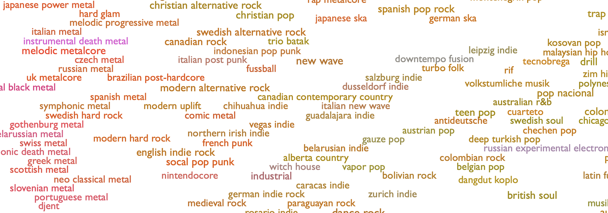
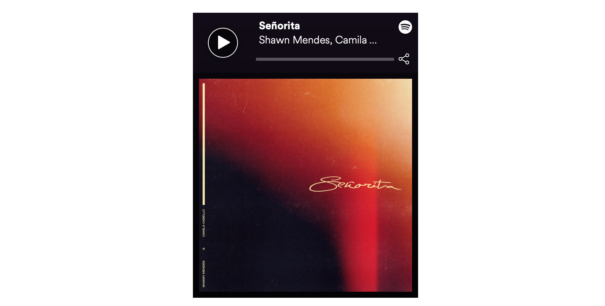

# Music Genre Analysis Using the Spotify Web API

[](developer.spotify.com)


## Table of Contents  
* [Overview](##overview)<BR>
* [Goals](##goals)<BR>
* [Building a Data Pipeline](##data_pipeline)<BR>
  * [Endpoints](##endpoints)<BR>
  * [Data Acquisition and Processing](##data_acquisition)<BR>
  * [Data Pipeline Challenges](##pipeline_challenges)<BR>
* [Simplifying Genre Information](##simplifying_genre)<BR>
  * [Who Comes Up With 1,499 Different Genre Names?](##genres_background)<BR>
* [How can I maximize my chances of making a popular song on Spotify?](##maximize_popularity)<BR>
  * [Popularity In General](##general_popularity)<BR>
  * [Popularity By Genre](##genre_popularity)<BR>
  * [Trap Music Genre Analysis](##trap_genre)<BR>
* [Conclusion and Future Project Ideas](##conclusion_future)<BR>


<a name="#overview"></a>

## Overview

As a musician and a tech enthusiast, I am always interested in new developments that occur at the interface between creativity and technology. [Spotify](https://www.spotify.com/is/) was founded in 2006 and has become the [biggest paid-for streaming service on the planet](https://www.rollingstone.com/music/music-features/who-will-own-spotify-in-five-years-876693/). Spotify is a very data-driven company, so I was interested in performing some data analysis around music genres and popularity. 

<a name="#goals"></a>

## Goals

### Question to be answered: How can I maximize my chances of making a popular song on Spotify?

* Compare Spotify track popularity data with other metrics to see if any interesting correlations exist.
* Gain experience using a RESTful API and building a data pipeline from JSON responses to a Python environment.


<a name="#data_pipeline"></a>

## Building a Data Pipeline

Spotify has extensive documentation online for their APIs and SDKs located at [Spotify for Developers](https://developer.spotify.com). My goal was to use Python to perform my data analysis, so I used [Spotipy](https://spotipy.readthedocs.io), which is a lightweight Python library for the Spotify Web API. As a [RESTful API](https://restfulapi.net), the various Spotify Web API [endpoints](https://developer.spotify.com/documentation/web-api/reference/) return data in JSON format in response to queries.

<a name="#endpoints"></a>

### Endpoints

For this project I used the following Sporify Web API endpoints:<BR>

* [Search Endpoint](https://developer.spotify.com/documentation/web-api/reference/search/search/) to get a list of 10,000 albums (API max offset) with 2019 release dates.<BR>

* [Get Several Albums Endpoint](https://developer.spotify.com/documentation/web-api/reference/search/search/) to get additional details for all albums, including **genre**. Genre information is not available at the track level, so I got it at the album level here.<BR>

* [Get Album Tracks Endpoint](https://developer.spotify.com/documentation/web-api/reference/albums/get-albums-tracks/) to get the track IDs for the album list, which ended up being around 55,000.<BR>

* [Get Audio Features for Several Tracks Endpoint](https://developer.spotify.com/documentation/web-api/reference/tracks/get-several-audio-features/) to get audio features details for all 55,000 tracks.<BR>

* [Get Several Tracks Endpoint](https://developer.spotify.com/documentation/web-api/reference/tracks/get-several-tracks/) to get details such as popularity and duration for all 55,000 tracks.<BR>

I set up my **Web API access** for both Spotipy and [Postman](https://www.getpostman.com), which is a widely used, free **REST API Client**. The direct Web API access that Postman provided was helpful for quickly checking requests and responses, and then I used Python via Spotipy to submit and process scripted batch requests.

[](https://developer.spotify.com/documentation/general/guides/authorization-guide/)

Once I had my **Client ID** and **Client Secret Keys** set up as **environment variables** on my local system for security purposes, I created a **Python class** in order to perform my API data retrieval. I implemented the [Client Credentials Flow using the OAuth 2.0 protocol](https://developer.spotify.com/documentation/general/guides/authorization-guide/), since this option has a **higher rate limit**. In Postman, I used the simpler Authorization Code Flow, which was sufficient for the intermittent calls I was making.

<a name="#data_acquisition"></a>

### Data Acquisition and Processing

My goal was to get as much data as possible from a limited time range, so I tried get as many tracks from 2019 as possible. When iterating through a long API response list, the **maximum offset** is currently **10,000**, which means that it is not possible to build a list of more than 10,000 items (e.g. songs) from one call.

To maximize my list, I limited my search to **albums** with a release date in the year **2019**, and got to the API limit of 10,000 items. From there, I followed the steps detailed in the [Endpoints](##endpoints) section above to build a fully-featured track list.

This left me with a pandas dataframe with **54680 rows and 27 columns**.

<a name="#pipeline_challenges"></a>

### Data Pipeline Challenges

The data retrieval was a significant part of this project. Some of the biggest challenges came from the complicated, nested JSON responses. Here is a short excerpt of a [Search Endpoint](https://developer.spotify.com/documentation/web-api/reference/search/search/) response:

```yaml
{
  "albums": {
    "href": "https://api.spotify.com/v1/search?query=year%3A2019&type=album&market=US&offset=0&limit=20",
    "items": [
      {
        "album_type": "album",
        "artists": [
          {
            "external_urls": {
              "spotify": "https://open.spotify.com/artist/06HL4z0CvFAxyc27GXpf02"
            },
            "href": "https://api.spotify.com/v1/artists/06HL4z0CvFAxyc27GXpf02",
            "id": "06HL4z0CvFAxyc27GXpf02",
            "name": "Taylor Swift",
            "type": "artist",
            "uri": "spotify:artist:06HL4z0CvFAxyc27GXpf02"
          }
```
The data was extracted within the queries using nested for-loops, like the following sample:
```python
def spotipy_album_search(self, range_limit=10000, search_year=2019):
    for i in range(0,range_limit,50):
        album_results = self.sp.search(q='year:' + str(search_year),
                                        type='album', market='US', limit=50,
                                        offset=i)
        for i, j in enumerate(album_results['albums']['items']):
            artist_name.append(j['artists'][0]['name'])
            album_name.append(j['name'])
```
<a name="#simplifying_genre"></a>

## Simplifying Genre Information

Once I had my data, an issue with the genre information became apparent. The genre information was in the form of lists of very specific genre tags, like this example from a single track:

```python
"dmv rap, hip hop, pop rap, rap, trap music, underground hip hop, vapor trap"
```

An analysis showed that there were **1499 unique genre tags** in my data set. In order to make this information usable, I split all of these genre tags into individual words and analyzed their relative frequencies:


Based on this information, I decided to group the tracks into **12 categories by genre**. These were more or less the most popular, after removing some nationalities ("German", "Dutch", "Swedish", etc.) and less musical categories, like "hoerspiel" (German for "radio play").

```python
'Pop', 'Hip-Hop', 'Rap', 'Trap', 'Rock', 'Indie', 'House',
'Alternative', 'Latin', 'R&B', 'EDM', 'Trance'
```

<a name="#genres_background"></a>

### Who Comes Up With 1,499 Different Genre Names?

After discovering the (seemingly unreasonable) scope of genre tags, I got curious and did some more research into this part of Spotify's technology. As it turns out, Spotify aquired [The Echo Nest](https://en.wikipedia.org/wiki/The_Echo_Nest) in 2014, which is a music intelligence and data platform for developers and media companies. The company began as a research spin-off from the [MIT Media Lab](https://www.media.mit.edu) with the goal of understanding the audio and textual content of recorded music, and Spotify now uses this technology extensively.

For a deeper dive into this genre complexity, I highly recommend visiting everynoise.com. From the creators:

> *Every Noise at Once is an ongoing attempt at an algorithmically-generated, readability-adjusted scatter-plot of the musical genre-space, based on data tracked and analyzed for 3,482 genre-shaped distinctions by Spotify.*

[](http://everynoise.com)

<a name="#maximize_popularity"></a>

## How can I maximize my chances of making a popular song on Spotify?

<a name="#general_popularity"></a>

### Popularity In General

The Spotify API reference for **Popularity** offers the following description:

> *The popularity of a track is a value between 0 and 100, with 100 being the most popular. The popularity is calculated by algorithm and is based, in the most part, on the total number of plays the track has had and how recent those plays are.*

A quick sort revealed the most popular song in the data set, *Señorita* by *Shawn Mendes*, with a Popularity sore of 100:

[](https://p.scdn.co/mp3-preview/8eab3a5695bfaed5449e0787146f857fb9635907?cid=3bb746dbeccf420f9210e16d14c951f3)

In order to get a better understanding of the distribution of popularity scores in the data set, an analysis of the **Popularity** ratings in my data set showed that the **top 20% most popular tracks** had a popularity rating of **50** or above. A histogram also shows that only very few songs have popularity scores above 70%, which is consistent with the general trend that there are only a few major hits at any given time.


<a name="#genre_popularity"></a>

### Popularity By Genre

I assigned tracks to genres if the genre name was present in their genre tags, which means that one track might be assigned to more than one genre. For the purposes of this project, I decided that was preferable to assigning each track to one unique genre only. I then separated out the globally "popular" from the "unpopular" tracks.


While Pop music (unsurprisingly) has both the highest number of total tracks as well as popular tracks, the **Trap Music** genre actually has the highest percentage of popular songs, so I will focus the rest of my analysis here.


<a name="#trap_genre"></a>

### Trap Music Genre Analysis

For the uninitiated, Wikipedia describes [Trap music](https://en.wikipedia.org/wiki/Trap_music) as follows:

> *Trap music is a style of hip hop music that was developed in the late 1990s to early 2000s in the Southern United States. It is typified by sub-divided hi-hats, heavy, sub-bass layered kick drums in the style of the Roland TR-808 drum machine, typically in half time syncopated rhythms[...]*

Within the **Trap Genre**, a plot comparing track duration to popularity shows a familiar distribution with most tracks clustered around a duration just under four minutes.


I was interested in the outlier at a **popularity score of almost 80** and a **duration of almost 10 minutes**. This ended up being the following track from Brazil:

[](https://p.scdn.co/mp3-preview/d03fdbd2c77e9d5d59eca6540210af2ebaca94ce?cid=3bb746dbeccf420f9210e16d14c951f3)

In order to see what other factors might influence the popularity of a track within the Trap Music genre, I created a heatmap of the correlations within the **Audio Features for all of the tracks in this genre**. The heatmap shows that **Popularity** is positively correlated with **Loudness** and **Danceability**, which is not surprising.


As a final analysis, I checked which songs had the **highest values for several of the Audio Features within the Trap genre**. The song with the maximum **Danceability** score is worth sharing. Please enjoy a sample of the **most danceable Trap song** of 2019, as chosen by **Spotify's Audio Features algorithm**.

[](https://p.scdn.co/mp3-preview/3638dbb64db71281dd0a62f6c9f045a350f68582?cid=3bb746dbeccf420f9210e16d14c951f3)

## Conclusion: How can I maximize my chances of making a popular song on Spotify?
### 1. Make a Trap song.
### 2. Shoot for high Loudness and Danceability.
### 3. ???
### 4. Profit.


<a name="#conclusion_future"></a>

## Summary and Future Project Ideas

I very much enjoyed getting to know the Spotify Web API, and I was very pleased to see that they have such extensive resources available for developers who are using their platform.

As a rock musician, I was disappointed (but not surprised) to see that the **Rock Music Genre had the lowest ratio of popular tracks to unpopular tracks** of the major genres. This certainly reflects general trends within the music indistry today, but might also be influenced by the type of music consumer who is active on Spotify. Maybe all of the Rock Music fans are enjoying their hipster record players!

The **API pipeline** I built is fairly flexible, so performing a similar analysis on a different data set would be very easy. For example, collecting a sample of X number of albums for each release year for the past 10 years to look at trends over time would be require only minimal additional work.

Some of what makes Spotify so good at what they do is their excellent use of **Machine Learning, AI and Recommender Algorithms**. Exploring this side of their system would require different tools and user behavior data that isn't readily available via the Web API, but Spotify has published several large data sets on their [Research Page](https://research.spotify.com/datasets), so a project along those lines would certainly be possible in the future.


<a name="#references"></a>

## References

* [Spotify for Developers](https://developer.spotify.com)
* [Spotify Web API Tutorial](https://developer.spotify.com/documentation/web-api/quick-start/)
* [Spotipy](https://spotipy.readthedocs.io)
* [Spotipy Getting Started Guide](https://spotipy.readthedocs.io/en/latest/#getting-started)
* [Ian Annase - Spotipy Tutorial Series (YouTube)](https://www.youtube.com/playlist?list=PLqgOPibB_QnzzcaOFYmY2cQjs35y0is9N)
* [Tomi Gelo (tgel0) - Spotify Data Project (GitHub)](https://github.com/tgel0/spotify-data)
* [AsTimeGoesBy111 - Spotify Music Data Analysis (GitHub)](https://github.com/AsTimeGoesBy111/Spotify-Music-Data-Analysis)
* Worried about all of those completely un-popular tracks on Spotify? Check out http://forgotify.com.